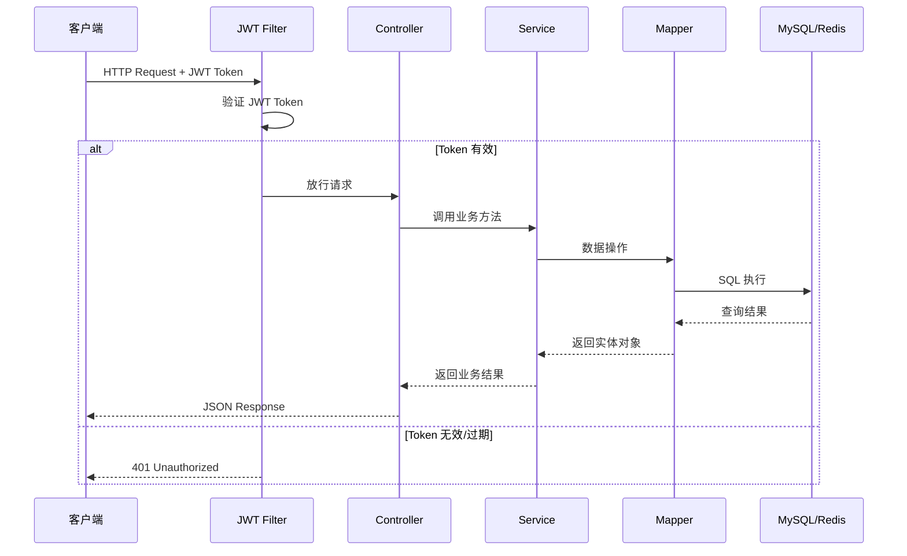
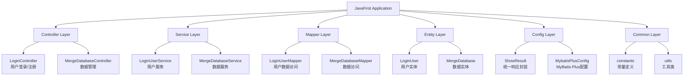
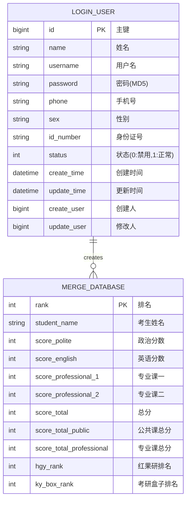
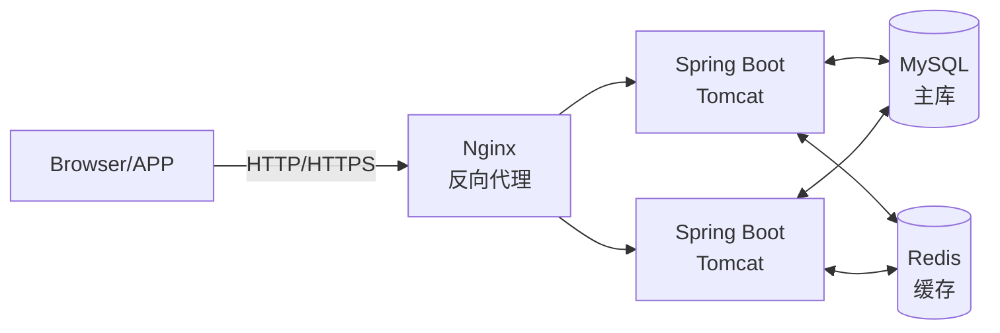

# JOSP-FirstProjectJava - 通用增删改查模板项目


基于 Spring Boot 3.4.4 + MyBatis-Plus 的通用增删改查后端模板项目，提供完整的后台管理接口结构。适用于快速构建后台管理系统、RESTful API 服务等场景。

---

## 目录

- [技术栈](#技术栈)
- [项目架构](#项目架构)
- [请求处理流程](#请求处理流程)
- [项目模块结构](#项目模块结构)
- [实体关系图](#实体关系图)
- [主要功能](#主要功能)
- [快速开始](#快速开始)
- [配置说明](#配置说明)
- [API 接口文档](#api-接口文档)
- [数据库设计](#数据库设计)
- [部署说明](#部署说明)
- [开发指南](#开发指南)
- [接口文档访问](#接口文档访问)

---

## 技术栈

| 类别 | 技术 | 版本 |
|------|------|------|
| 核心框架 | Spring Boot | 3.4.4 |
| Java 版本 | Java | 25 |
| ORM 框架 | MyBatis-Plus | 3.5.7 |
| 数据库 | MySQL | 8.0+ |
| 缓存 | Redis | 6.0+ |
| 接口文档 | Knife4j (Swagger) | 3.0.3 |
| 认证 | JWT | - |
| 构建工具 | Maven | 3.8+ |
| 工具库 | Hutool | 5.8.21 |
| JSON 处理 | Fastjson2 | 2.0.23 |
| 代码生成 | MyBatis-Plus Generator | 3.5.3.1 |

---

## 项目架构

### 请求处理流程



### 项目模块结构



```
src/main/java/wo1261931780/javaFirst/
├── JavaFirstApplication.java          # 应用启动类
├── controller/                         # 控制器层
│   ├── LoginController.java           # 用户登录/注册控制器
│   └── MergeDatabaseController.java    # 数据管理控制器
├── service/                            # 服务层
│   ├── LoginUserService.java          # 用户服务实现
│   └── MergeDatabaseService.java      # 数据服务实现
├── dao/                                # 数据访问层
│   ├── LoginUserMapper.java           # 用户Mapper接口
│   └── MergeDatabaseMapper.java       # 数据Mapper接口
├── entity/                             # 实体类
│   ├── LoginUser.java                 # 用户实体
│   └── MergeDatabase.java             # 数据实体
├── config/                             # 配置类
│   ├── ShowResult.java                # 统一响应封装
│   └── MybatisPlusConfig.java         # MyBatis-Plus配置
└── common/                             # 通用工具
    ├── constants/                      # 常量定义
    └── utils/                          # 工具类
```

### 实体关系图



### 部署架构图



---

## 主要功能

### 核心功能

| 功能 | 说明 |
|------|------|
| 用户管理 | 用户注册、登录、信息管理、密码MD5加密存储 |
| 数据管理 | 完整的增删改查（CRUD）操作，分页查询 |
| JWT 认证 | Token-based 用户认证机制 |
| 统一响应 | 全局统一响应格式封装（ShowResult） |
| 接口文档 | Knife4j 在线接口文档，支持在线测试 |
| 分页支持 | MyBatis-Plus 内置分页插件 |
| 自动填充 | 创建时间、更新时间、创建人等字段自动填充 |
| 跨域支持 | CORS 跨域配置 |

### 技术特性

- **MyBatis-Plus 增强**：内置通用 CRUD、Active Record 模式、条件构造器
- **代码生成器**：快速生成 Entity/Mapper/Service/Controller
- **多数据源支持**：dynamic-datasource 多数据源配置
- **Swagger 文档**：knife4j 提供美化的 API 文档界面

---

## 快速开始

### 环境要求

| 环境 | 版本要求 |
|------|----------|
| JDK | 25+ |
| Maven | 3.8+ |
| MySQL | 8.0+ |
| Redis | 6.0+ |

### 安装步骤

1. **克隆项目**
```bash
git clone https://github.com/JOSP-Project/JOSP-FirstProjectJava.git
cd JOSP-FirstProjectJava
```

2. **配置数据库**
```bash
# 修改 src/main/resources/application.yml
spring:
  datasource:
    url: jdbc:mysql://localhost:3306/your_database
    username: your_username
    password: your_password
    driver-class-name: com.mysql.cj.jdbc.Driver
```

3. **创建数据库**
```sql
CREATE DATABASE IF NOT EXISTS your_database DEFAULT CHARACTER SET utf8mb4 COLLATE utf8mb4_unicode_ci;
```

4. **编译项目**
```bash
mvn clean compile
```

5. **运行项目**
```bash
mvn spring-boot:run
```

6. **访问接口文档**
```
http://localhost:8081/doc.html
```

---

## 配置说明

### application.yml 完整配置

```yaml
spring:
  application:
    name: javaFirst
  datasource:
    url: jdbc:mysql://localhost:3306/postgraduate?useSSL=false&useUnicode=true&serverTimezone=Asia/Shanghai&characterEncoding=utf8&zeroDateTimeBehavior=convertToNull&allowPublicKeyRetrieval=true&allowMultiQueries=true
    username: root
    password: junw
    driver-class-name: com.mysql.cj.jdbc.Driver
  jackson:
    date-format: yyyy-MM-dd HH:mm:ss
    time-zone: GMT+8

server:
  port: 8081

mybatis-plus:
  configuration:
    map-underscore-to-camel-case: true
    log-impl: org.apache.ibatis.logging.stdout.StdOutImpl
  global-config:
    db-config:
      id-type: auto
      logic-delete-field: deleted
      logic-delete-value: 1
      logic-not-delete-value: 0

knife4j:
  enable: true
  setting:
    language: zh_cn
```

### 多环境配置

通过 Maven Profile 实现多环境切换：

```bash
# 开发环境
mvn spring-boot:run -Pdev

# 生产环境
mvn spring-boot:run -Pprod

# 打包
mvn clean package -Pprod -DskipTests
```

---

## API 接口文档

### 统一响应格式

所有接口统一返回 `ShowResult` 对象：

```json
{
  "code": 1,
  "msg": "success",
  "data": { }
}
```

| code | 说明 |
|------|------|
| 1 | 成功 |
| 0 | 失败 |

---

### 认证接口

#### 用户登录/注册

| 接口 | 方法 | 描述 |
|------|------|------|
| `/user/login` | POST | 用户登录（带id参数）或注册（无id参数） |

**请求参数：**

| 参数名 | 类型 | 必填 | 说明 |
|--------|------|------|------|
| id | Long | 否 | 用户ID（有则登录，无则注册） |
| username | String | 是 | 用户名 |
| password | String | 是 | 密码（MD5加密传输） |
| name | String | 否 | 姓名 |
| phone | String | 否 | 手机号 |
| sex | String | 否 | 性别 |
| idNumber | String | 否 | 身份证号 |

**登录请求示例：**
```json
{
  "id": 123456789,
  "username": "admin",
  "password": "e10adc3949ba59abbe56e057f20f883e"
}
```

**注册请求示例：**
```json
{
  "username": "newuser",
  "password": "123456",
  "name": "张三",
  "phone": "13800138000",
  "sex": "男"
}
```

**响应示例：**
```json
{
  "code": 1,
  "msg": "success",
  "data": {
    "id": 123456789,
    "name": "管理员",
    "username": "admin",
    "phone": "13800138000",
    "sex": "男",
    "status": 1,
    "createTime": "2024-01-01 12:00:00"
  }
}
```

---

### 数据管理接口

#### 分页查询

| 接口 | 方法 | 描述 |
|------|------|------|
| `/MergeDatabase` | GET | 分页查询数据列表 |

**请求参数：**

| 参数名 | 类型 | 必填 | 说明 |
|--------|------|------|------|
| pageSize | Integer | 是 | 每页条数 |
| currentPage | Integer | 是 | 当前页码 |

**请求示例：**
```
GET /MergeDatabase?pageSize=10&currentPage=1
```

**响应示例：**
```json
{
  "code": 1,
  "msg": "success",
  "data": {
    "records": [
      {
        "rank": 1,
        "studentName": "张三",
        "scorePolite": 75,
        "scoreEnglish": 82,
        "scoreProfessional1": 130,
        "scoreProfessional2": 128,
        "scoreTotal": 415,
        "scoreTotalPublic": 157,
        "scoreTotalProfessional": 258,
        "hgyRank": 1,
        "kyBoxRank": 2
      }
    ],
    "total": 100,
    "size": 10,
    "current": 1,
    "pages": 10
  }
}
```

---

#### 新增/修改数据

| 接口 | 方法 | 描述 |
|------|------|------|
| `/MergeDatabase` | POST | 新增或修改数据 |

**请求参数：**

| 参数名 | 类型 | 必填 | 说明 |
|--------|------|------|------|
| rank | Integer | 否 | 排名（主键） |
| studentName | String | 否 | 考生姓名 |
| scorePolite | Integer | 否 | 政治分数 |
| scoreEnglish | Integer | 否 | 英语分数 |
| scoreProfessional1 | Integer | 否 | 专业课一 |
| scoreProfessional2 | Integer | 否 | 专业课二 |
| scoreTotal | Integer | 否 | 总分 |
| scoreTotalPublic | Integer | 否 | 公共课总分 |
| scoreTotalProfessional | Integer | 否 | 专业课总分 |
| hgyRank | Integer | 否 | 红果研排名 |
| kyBoxRank | Integer | 否 | 考研盒子排名 |

**请求示例：**
```json
{
  "rank": 1,
  "studentName": "张三",
  "scorePolite": 75,
  "scoreEnglish": 82,
  "scoreProfessional1": 130,
  "scoreProfessional2": 128,
  "scoreTotal": 415
}
```

**响应示例：**
```json
{
  "code": 1,
  "msg": "成功",
  "data": null
}
```

---

#### 删除数据

| 接口 | 方法 | 描述 |
|------|------|------|
| `/MergeDatabase/{id}` | DELETE | 根据ID删除数据 |

**请求参数：**

| 参数名 | 类型 | 必填 | 说明 |
|--------|------|------|------|
| id | Integer | 是 | 要删除的数据ID |

**请求示例：**
```
DELETE /MergeDatabase/1
```

**响应示例：**
```json
{
  "code": 1,
  "msg": "删除成功",
  "data": null
}
```

---

### 接口汇总表

| 模块 | 接口路径 | 方法 | 描述 | 认证 |
|------|----------|------|------|------|
| 用户 | `/user/login` | POST | 用户登录/注册 | 否 |
| 数据 | `/MergeDatabase` | GET | 分页查询 | 否 |
| 数据 | `/MergeDatabase` | POST | 新增/修改 | 否 |
| 数据 | `/MergeDatabase/{id}` | DELETE | 删除 | 否 |

---

## 数据库设计

### 用户表 (login_user)

```sql
CREATE TABLE `login_user` (
  `id` BIGINT NOT NULL COMMENT '主键',
  `name` VARCHAR(50) DEFAULT NULL COMMENT '姓名',
  `username` VARCHAR(50) NOT NULL COMMENT '用户名',
  `password` VARCHAR(100) NOT NULL COMMENT '密码(MD5)',
  `phone` VARCHAR(20) DEFAULT NULL COMMENT '手机号',
  `sex` VARCHAR(10) DEFAULT NULL COMMENT '性别',
  `id_number` VARCHAR(20) DEFAULT NULL COMMENT '身份证号',
  `status` TINYINT DEFAULT 1 COMMENT '状态 0:禁用 1:正常',
  `create_time` DATETIME DEFAULT CURRENT_TIMESTAMP COMMENT '创建时间',
  `update_time` DATETIME DEFAULT CURRENT_TIMESTAMP ON UPDATE CURRENT_TIMESTAMP COMMENT '更新时间',
  `create_user` BIGINT DEFAULT NULL COMMENT '创建人',
  `update_user` BIGINT DEFAULT NULL COMMENT '修改人',
  PRIMARY KEY (`id`),
  UNIQUE KEY `uk_username` (`username`)
) ENGINE=InnoDB DEFAULT CHARSET=utf8mb4 COLLATE=utf8mb4_unicode_ci COMMENT='登录用户表';
```

### 数据表 (merge_database)

```sql
CREATE TABLE `merge_database` (
  `rank` INT NOT NULL COMMENT '排名',
  `student_name` VARCHAR(50) DEFAULT NULL COMMENT '考生姓名',
  `score_polite` INT DEFAULT NULL COMMENT '政治',
  `score_english` INT DEFAULT NULL COMMENT '英语',
  `score_professional_1` INT DEFAULT NULL COMMENT '专业课一',
  `score_professional_2` INT DEFAULT NULL COMMENT '专业课二',
  `score_total` INT DEFAULT NULL COMMENT '总分',
  `score_total_public` INT DEFAULT NULL COMMENT '公共课总分',
  `score_total_professional` INT DEFAULT NULL COMMENT '专业课总分',
  `hgy_rank` INT DEFAULT NULL COMMENT '红果研排名',
  `ky_box_rank` INT DEFAULT NULL COMMENT '考研盒子排名',
  PRIMARY KEY (`rank`)
) ENGINE=InnoDB DEFAULT CHARSET=utf8mb4 COLLATE=utf8mb4_unicode_ci COMMENT='红果研考研盒子合并数据库';
```

---

## 部署说明

### 环境准备

1. **安装 JDK 25**
```bash
# 下载 JDK 25
# 配置环境变量
export JAVA_HOME=/path/to/jdk-25
export PATH=$JAVA_HOME/bin:$PATH
```

2. **安装 MySQL 8.0+**
```bash
# Ubuntu
sudo apt install mysql-server

# macOS (Homebrew)
brew install mysql
```

3. **安装 Redis 6.0+**
```bash
# Ubuntu
sudo apt install redis-server

# macOS (Homebrew)
brew install redis
```

### 构建部署

1. **打包项目**
```bash
mvn clean package -DskipTests
```

2. **生成 jar 包**
```
target/javaFirst-0.0.1-SNAPSHOT.jar
```

3. **启动服务**
```bash
# 前台运行
java -jar target/javaFirst-0.0.1-SNAPSHOT.jar

# 后台运行
nohup java -jar target/javaFirst-0.0.1-SNAPSHOT.jar > app.log 2>&1 &

# 指定端口
java -jar target/javaFirst-0.0.1-SNAPSHOT.jar --server.port=8081
```

### Docker 部署（可选）

```dockerfile
FROM eclipse-temurin:25-jre
COPY target/javaFirst-0.0.1-SNAPSHOT.jar /app/app.jar
WORKDIR /app
EXPOSE 8081
ENTRYPOINT ["java", "-jar", "app.jar"]
```

```bash
# 构建镜像
docker build -t javafirst:latest .

# 运行容器
docker run -d -p 8081:8081 --name javafirst javafirst:latest
```

### Nginx 反向代理配置

```nginx
upstream javafirst {
    server 127.0.0.1:8081;
    keepalive 64;
}

server {
    listen 80;
    server_name your-domain.com;

    location / {
        proxy_pass http://javafirst;
        proxy_set_header Host $host;
        proxy_set_header X-Real-IP $remote_addr;
        proxy_set_header X-Forwarded-For $proxy_add_x_forwarded_for;
    }

    location /doc.html {
        proxy_pass http://javafirst/doc.html;
    }
}
```

---

## 开发指南

### 添加新模块

1. **创建实体类**
```java
@ApiModel(description = "模块描述")
@Data
@AllArgsConstructor
@NoArgsConstructor
@TableName(value = "table_name")
public class XxxEntity implements Serializable {
    @TableId(value = "id", type = IdType.AUTO)
    private Long id;

    @TableField(value = "field_name")
    @ApiModelProperty(value = "字段描述")
    private String fieldName;
}
```

2. **创建 Mapper 接口**
```java
public interface XxxMapper extends BaseMapper<XxxEntity> {
}
```

3. **创建 Service**
```java
@Service
public class XxxService extends ServiceImpl<XxxMapper, XxxEntity> {
}
```

4. **创建 Controller**
```java
@RestController
@RequestMapping("/xxx")
public class XxxController {
    @Autowired
    private XxxService xxxService;

    @GetMapping
    public ShowResult<Page<XxxEntity>> list() {
        // 实现代码
    }
}
```

### 代码生成器使用

```java
FastAutoGenerator.create(url, username, password)
    .globalConfig(builder -> {
        builder.author("author") // 设置作者
            .outputDir("src/main/java"); // 输出目录
    })
    .packageConfig(builder -> {
        builder.parent("com.example") // 设置父包名
            .moduleName("system"); // 设置模块名
    })
    .strategyConfig(builder -> {
        builder.addInclude("table_name") // 设置表名
            .controllerBuilder().enableRestStyle(); // 启用 REST 风格
    })
    .execute();
```

---

## 接口文档访问

项目启动后，通过以下地址访问 Knife4j 接口文档：

| 地址 | 说明 |
|------|------|
| http://localhost:8081/doc.html | Knife4j 在线文档（推荐） |
| http://localhost:8081/swagger-ui/index.html | Swagger UI |
| http://localhost:8081/v3/api-docs | OpenAPI 3.0 JSON |

---

## 常见问题

### 1. 启动报错 "Unable to obtain connection from database"
检查 MySQL 服务是否启动，以及 `application.yml` 中的数据库连接配置是否正确。

### 2. JDK 版本不兼容
确保使用 JDK 25，项目 `pom.xml` 中配置 `<java.version>25</java.version>`。

### 3. 接口文档无法访问
确认 `pom.xml` 中已引入 `knife4j-spring-boot-starter` 依赖。

### 4. 分页不生效
确保 Mapper 接口继承 `BaseMapper<T>`，Service 继承 `ServiceImpl<Mapper, Entity>`。

---

## License

MIT License

Copyright (c) 2024 JOSP Project

Permission is hereby granted, free of charge, to any person obtaining a copy
of this software and associated documentation files (the "Software"), to deal
in the Software without restriction, including without limitation the rights
to use, copy, modify, merge, publish, distribute, sublicense, and/or sell
copies of the Software, and to permit persons to whom the Software is
furnished to do so, subject to the following conditions:

The above copyright notice and this permission notice shall be included in all
copies or substantial portions of the Software.

THE SOFTWARE IS PROVIDED "AS IS", WITHOUT WARRANTY OF ANY KIND, EXPRESS OR
IMPLIED, INCLUDING BUT NOT LIMITED TO THE WARRANTIES OF MERCHANTABILITY,
FITNESS FOR A PARTICULAR PURPOSE AND NONINFRINGEMENT. IN NO EVENT SHALL THE
AUTHORS OR COPYRIGHT HOLDERS BE LIABLE FOR ANY CLAIM, DAMAGES OR OTHER
LIABILITY, WHETHER IN AN ACTION OF CONTRACT, TORT OR OTHERWISE, ARISING FROM,
OUT OF OR IN CONNECTION WITH THE SOFTWARE OR THE USE OR OTHER DEALINGS IN THE
SOFTWARE.
