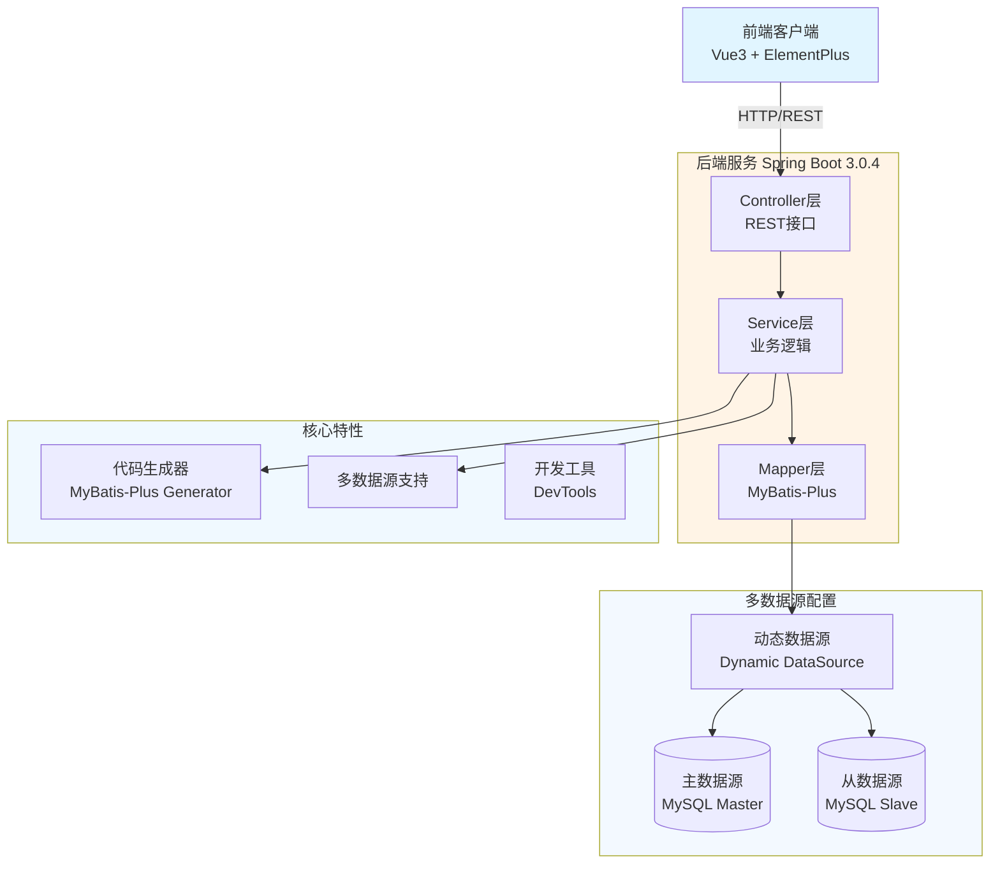

# JOSP-FirstProjectJava - 通用增删改查模板项目


> JOSP系列通用增删改查模板项目,支持多数据源

## 📖 项目简介

JOSP-FirstProjectJava 是 JOSP 系列的通用模板项目,提供了完整的增删改查(CRUD)基础功能,支持多数据源配置,可作为快速开发新项目的起点。项目已完成 MyBatis-Plus 依赖升级,后续主要用于依赖更新维护。

**前端项目**: [JOSP-FirstProjectVue3](../JOSP-FirstProjectVue3)

## 🏗️ 系统架构



## 🛠️ 技术栈

| 技术 | 版本 | 说明 |
|------|------|------|
| **Spring Boot** | 3.0.4 | 核心框架 |
| **Java** | 17 | 开发语言 |
| **MyBatis-Plus** | 3.5.7 | ORM框架 |
| **MySQL** | 8.0.32 | 数据库 |
| **Knife4j** | 3.0.3 | API文档 |
| **Hutool** | 5.8.21 | 工具库 |
| **Dynamic Datasource** | 3.5.0 | 多数据源 |

## 📦 核心依赖

### Web层
- `spring-boot-starter-web` - Web开发
- `spring-boot-starter-webflux` - 响应式Web
- `spring-boot-starter-web-services` - Web服务

### 数据层
- `mybatis-plus-spring-boot3-starter` - MyBatis增强
- `dynamic-datasource-spring-boot-starter` - 多数据源支持
- `mybatis-plus-generator` - 代码生成器
- `velocity-engine-core` - 模板引擎

### 工具层
- `lombok` - 简化代码
- `hutool-all` - 工具集
- `fastjson2` - JSON处理
- `commons-fileupload` - 文件上传

## 🚀 快速开始

### 环境要求
- JDK 17+
- Maven 3.6+
- MySQL 8.0+

### 安装步骤

1. **克隆项目**
```bash
git clone https://github.com/your-username/JOSP-FirstProjectJava.git
cd JOSP-FirstProjectJava
```

2. **配置数据库**
```bash
# 创建数据库
CREATE DATABASE josp_template;

# 导入SQL脚本(如果存在)
mysql -u root -p josp_template < db/schema.sql
```

3. **修改配置**
```yaml
# application.yml
spring:
  datasource:
    dynamic:
      primary: master  # 设置默认数据源
      strict: false    # 严格匹配数据源
      datasource:
        master:
          url: jdbc:mysql://localhost:3306/josp_template
          username: root
          password: your_password
        slave:
          url: jdbc:mysql://localhost:3306/josp_template_slave
          username: root
          password: your_password
```

4. **运行项目**
```bash
mvn clean install
mvn spring-boot:run
```

5. **访问服务**
- 后端地址: http://localhost:8088
- API文档: http://localhost:8088/doc.html

## 📁 项目结构

```
JOSP-FirstProjectJava/
├── src/main/java/
│   └── wo1261931780/
│       ├── controller/          # 控制器层
│       ├── service/             # 业务逻辑层
│       ├── mapper/              # 数据访问层
│       ├── entity/              # 实体类
│       ├── config/              # 配置类
│       │   ├── DataSourceConfig.java    # 多数据源配置
│       │   └── MybatisPlusConfig.java   # MyBatis配置
│       └── utils/               # 工具类
├── src/main/resources/
│   ├── application.yml          # 主配置文件
│   ├── application-dev.yml      # 开发环境配置
│   ├── application-prod.yml     # 生产环境配置
│   └── mapper/                  # MyBatis映射文件
└── pom.xml                      # Maven依赖配置
```

## 🔧 核心功能模块

### 1. 用户登录与注册

```java
// LoginController.java
@PostMapping("/user/login")
public ShowResult<LoginUser> userLogin(@RequestBody LoginUser loginUser) {
    // 用户名密码验证
    // MD5密码加密
    // UUID生成用户ID
    // 自动注册或登录
}
```

**功能特性:**
- 用户登录验证
- 新用户自动注册
- MD5密码加密
- UUID生成用户ID
- MyBatis-Plus Lambda查询

### 2. 考研复试名单管理

**数据表:** `history22_review` (22年复试名单)

**核心字段:**
- `rank` - 初试排名
- `student_name` - 考生姓名
- `student_code` - 考生编号
- `subject_code` - 学科代码
- `subject_name` - 学科名称
- `score_polite` - 政治成绩
- `score_english` - 英语成绩
- `score_professional_1` - 专业课一成绩
- `score_professional_2` - 专业课二成绩
- `score_total` - 总分
- `score_total_public` - 公共课总分
- `score_total_professional` - 专业课总分

### 3. 数据库合并工具

```java
// MergeDatabaseController.java
@GetMapping("/MergeDatabase")
public ShowResult<Page<MergeDatabase>> showMePage(
    @RequestParam Integer pageSize,
    @RequestParam Integer currentPage) {
    // 分页查询数据库记录
}

@PostMapping("/MergeDatabase")
public ShowResult<String> insertOne(@RequestBody MergeDatabase mergeDatabase) {
    // 插入或更新数据
}

@DeleteMapping("/MergeDatabase/{id}")
public ShowResult<String> delOne(@PathVariable Integer id) {
    // 删除记录
}
```

**功能特性:**
- 分页查询数据库记录
- 数据插入/更新
- 数据删除
- 数据库合并工具

### 4. 多数据源配置
```java
@Service
@DS("slave")  // 使用从数据源
public class UserService {
    // 业务逻辑
}
```

## 📊 数据库表结构

### 用户表 (login_user)

| 字段名 | 类型 | 说明 |
|--------|------|------|
| id | BIGINT | 用户ID (UUID) |
| username | VARCHAR | 用户名 |
| password | VARCHAR | 密码 (MD5加密) |

### 22年复试名单表 (history22_review)

| 字段名 | 类型 | 说明 |
|--------|------|------|
| rank | INT | 初试排名 (主键) |
| student_name | VARCHAR | 考生姓名 |
| student_code | VARCHAR | 考生编号 |
| subject_code | INT | 学科代码 |
| subject_name | VARCHAR | 学科名称 |
| score_polite | INT | 政治成绩 |
| score_english | INT | 英语成绩 |
| score_professional_1 | INT | 专业课一成绩 |
| score_professional_2 | INT | 专业课二成绩 |
| score_total | INT | 总分 |
| score_total_public | INT | 公共课总分 |
| score_total_professional | INT | 专业课总分 |

### 数据库合并表 (merge_database)

用于数据库迁移和合并操作的临时表结构。

## 📝 开发指南

### 多环境配置
项目支持多环境配置:
- `dev` - 开发环境
- `test` - 测试环境
- `prod` - 生产环境

切换环境:
```bash
# Maven打包时指定环境
mvn clean package -P prod
```

### 数据源切换
使用 `@DS` 注解切换数据源:
```java
@DS("master")  // 主数据源
@DS("slave")   // 从数据源
@DS("custom")  // 自定义数据源
```

## 🔌 API文档

启动项目后访问 Knife4j 接口文档:
- 地址: http://localhost:8088/doc.html
- 功能: 在线接口测试、API文档查看

## 📊 性能优化建议

1. **数据库优化**
   - 合理使用索引
   - 开启查询缓存
   - 读写分离配置

2. **连接池优化**
   - 配置HikariCP连接池
   - 设置合理的连接数

3. **缓存策略**
   - 集成Redis缓存
   - 使用Spring Cache注解

## 📝 更新日志

### v0.0.1-SNAPSHOT
- 初始化项目结构
- 集成Spring Boot 3.0.4
- 配置多数据源支持
- 添加代码生成器功能
- 升级MyBatis-Plus至3.5.7

## 🤝 贡献指南

欢迎提交 Issue 和 Pull Request!

## 📄 许可证

本项目采用 AGPL-3.0 许可证 - 查看 [LICENSE](LICENSE) 文件了解详情

## 📮 联系方式

- 作者: junw
- Email: wo1261931780@gmail.com
- GitHub: [@wo1261931780](https://github.com/wo1261931780)

## 🙏 致谢

感谢 MyBatis-Plus、Spring Boot 等开源项目的支持!

---

**提示**: 本项目作为 JOSP 系列的通用模板,可用于快速搭建新的后端项目。建议根据实际需求调整依赖和配置。
