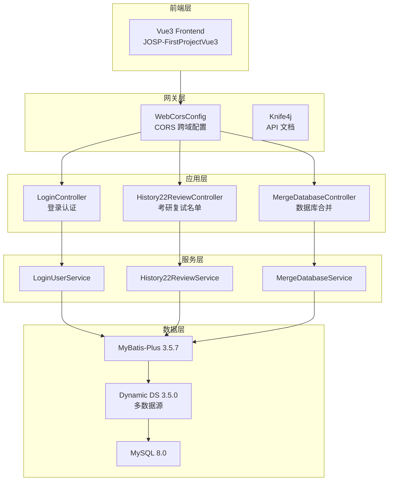
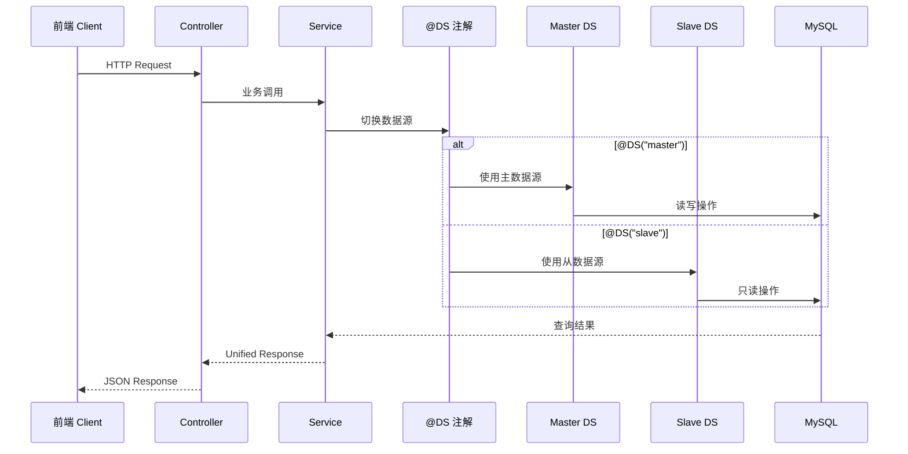
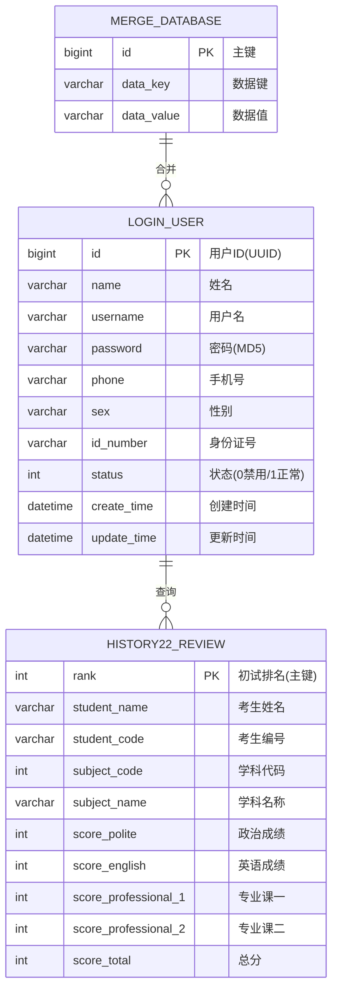

# JOSP-FirstProjectJava 项目规格说明书

## 1. 项目概述

- **项目名称**: JOSP-FirstProjectJava
- **项目类型**: Spring Boot 通用增删改查模板项目
- **核心功能**: 提供完整的 CRUD 基础功能，支持多数据源配置，可作为快速开发新项目的起点
- **目标用户**: 需要快速搭建 Spring Boot 后端项目的开发者

## 2. 技术栈

| 技术 | 版本 | 说明 |
|------|------|------|
| Spring Boot | 3.4.4 | 核心框架（LTS 版本） |
| Java | 25 | 开发语言 |
| MyBatis-Plus | 3.5.7 | ORM 框架 |
| MySQL Connector | 8.0.32 | 数据库驱动 |
| Knife4j | 3.0.3 | API 文档生成 |
| Hutool | 5.8.21 | 工具集 |
| Dynamic Datasource | 3.5.0 | 多数据源支持 |
| Lombok | 1.18.40 | 简化代码 |

## 3. 功能模块

### 3.1 核心功能

- **用户登录注册**: 用户名密码验证，MD5 密码加密，UUID 生成用户 ID
- **考研复试名单管理**: 初试排名、学生信息、成绩管理
- **数据库合并工具**: 分页查询、数据插入更新、删除操作

### 3.2 数据层

- **MyBatis-Plus**: 增强 ORM 能力，支持 Lambda 查询
- **多数据源**: 通过 `@DS` 注解切换主从数据源
- **代码生成器**: MyBatis-Plus Generator 自动生成代码

### 3.3 API 文档
- Knife4j 集成，提供在线接口测试和 API 文档查看
- 访问地址: http://localhost:8088/doc.html

---

## 4. 架构设计

### 4.1 系统架构图



### 4.2 多数据源请求流程



### 4.3 核心实体关系图



---

## 5. 数据库表结构

### 4.1 用户表 (login_user)

| 字段名 | 类型 | 说明 |
|--------|------|------|
| id | BIGINT | 用户 ID (UUID) |
| name | VARCHAR | 姓名 |
| username | VARCHAR | 用户名 |
| password | VARCHAR | 密码 (MD5加密) |
| phone | VARCHAR | 手机号 |
| sex | VARCHAR | 性别 |
| id_number | VARCHAR | 身份证号 |
| status | INT | 状态 0:禁用，1:正常 |
| create_time | DATETIME | 创建时间 |
| update_time | DATETIME | 更新时间 |

### 4.2 22年复试名单表 (history22_review)

| 字段名 | 类型 | 说明 |
|--------|------|------|
| rank | INT | 初试排名 (主键) |
| student_name | VARCHAR | 考生姓名 |
| student_code | VARCHAR | 考生编号 |
| subject_code | INT | 学科代码 |
| subject_name | VARCHAR | 学科名称 |
| score_polite | INT | 政治成绩 |
| score_english | INT | 英语成绩 |
| score_professional_1 | INT | 专业课一成绩 |
| score_professional_2 | INT | 专业课二成绩 |
| score_total | INT | 总分 |
| score_total_public | INT | 公共课总分 |
| score_total_professional | INT | 专业课总分 |

## 6. 项目结构

```
JOSP-FirstProjectJava/
├── src/main/java/wo1261931780/javaFirst/
│   ├── JavaFirstApplication.java          # Spring Boot 启动类
│   ├── config/                             # 配置类
│   │   ├── WebCorsConfig.java             # CORS 跨域配置
│   │   ├── ShowResult.java                # 统一返回结果
│   │   └── MybatisPlusConfig.java         # MyBatis-Plus 配置
│   ├── controller/                         # 控制层
│   │   ├── LoginController.java           # 登录控制器
│   │   ├── History22ReviewController.java # 复试名单控制器
│   │   └── MergeDatabaseController.java   # 数据库合并控制器
│   ├── service/                           # 服务层
│   │   └── impl/                          # 服务实现
│   ├── mapper/                            # 持久层
│   │   ├── LoginUserMapper.java
│   │   ├── History22ReviewMapper.java
│   │   └── MergeDatabaseMapper.java
│   └── entity/                            # 实体类
│       ├── LoginUser.java
│       ├── History22Review.java
│       └── MergeDatabase.java
├── src/main/resources/
│   ├── application.yml                    # 主配置文件
│   └── application-dev.yml                # 开发环境配置
├── pom.xml                                # Maven 配置
└── SPEC.md                                # 项目规格说明书
```

## 7. 配置说明

### 7.1 多数据源配置

```yaml
spring:
  datasource:
    dynamic:
      primary: master  # 设置默认数据源
      strict: false    # 严格匹配数据源
      datasource:
        master:
          url: jdbc:mysql://localhost:3306/josp?useUnicode=true
          username: root
          password: your_password
        slave:
          url: jdbc:mysql://localhost:3306/josp_slave?useUnicode=true
          username: root
          password: your_password
```

### 6.2 数据源切换

使用 `@DS` 注解切换数据源:
- `@DS("master")` - 主数据源
- `@DS("slave")` - 从数据源

## 8. 构建与部署

### 8.1 环境要求

- JDK 25+
- Maven 3.6+
- MySQL 8.0+

### 7.2 构建命令

```bash
# 编译
mvn compile -DskipTests

# 打包
mvn clean package -DskipTests

# 多环境打包
mvn clean package -P prod
```

## 9. 升级记录

### 9.1 本次升级 (v0.0.2-SNAPSHOT)

- Spring Boot: 3.0.4 → 3.4.4 (LTS)
- Java: 17 → 25
- maven-compiler-plugin: 3.2 → 3.12.1
- Lombok: → 1.18.40
- 完善项目文档

### 9.2 历史版本

- v0.0.1-SNAPSHOT: 初始版本，Spring Boot 3.0.4, Java 17
